# ConnectsCommonConnectivity

Common connectivity data models (LinkML) + dynamic Pydantic models for BRAIN CONNECTS pilot work.

## Goals
This repository is designed to help create a common connectivity "matrix" for cross comparison of data about connections and cells in the brain, focused on methods which have single axon resolution in the mouse brain.  Because connectivity data and the data we want to relate to is highly multi-modal, there is not a singular kind of matrix which can represent it.  Instead, there are a set of inter-connected concepts which share some common data shapes.  For example, single cell synaptic connectivity data measured by EM will measure connections between individual cells and give detailed morphology information (at least locally).  Single cell morphology reconstructions will contain long range projection information, but also skeleton based morphological information (both local and long range).  Patch-seq data can have local morphology data, but also gene expression and electrophysiology features.  Bar-seq can have projection distributions along with gene expression. So on and so forth across the methods.  Setting up a framework where different measurements of projections, or single cell morphology can all have the same data shape and be accessed in a single location through a common api will allow for integrative analysis that can transcend the impact of each individual dataset. 

The pilot of the Common Connectivity Pilot is focused on developing a framework that could be extended to the whole mouse brain, while importing dataset from mouse visual cortex, where there are examples of data from many of these modalities to demonstrate the power of integrative analysis. 

## Features

- Modular LinkML schema (aggregated by `schemas/connectivity_schema.yaml`)
- On-demand generation of Pydantic models (no pre-generated code needed for quick iteration)
- Example script in `examples/generate_and_use.py`
- Projection measurement modeling (per-cell vectors & aggregated matrices) example in `examples/projection_measurements_example.yaml`
- Packaged with `pyproject.toml` and intended to be managed via `uv`
- BrainRegion ETL example from Parquet (S3/local) via `examples/etl_brain_regions.py` or CLI `ccc etl-brain-regions`
- Generic Parquet→LinkML loader utility (`parquet_loader.py`) for any class in the schema

## Getting Started (with uv)

Install uv if you haven't:

```bash
curl -LsSf https://astral.sh/uv/install.sh | sh
```

Create a virtual environment and install this project in editable mode:

```bash
uv venv
source .venv/bin/activate
uv pip install -e .\[dev\]
```

Run tests:

```bash
uv run pytest -q
```

Run the example:

```bash
uv run python examples/generate_and_use.py
```

## Using the Dynamic Models

```python
from connects_common_connectivity import generate_pydantic_models
models = generate_pydantic_models()
BrainRegion = models["BrainRegion"]
br = BrainRegion(id="BR1", name="Region 1", species="mouse")

## Generic Parquet Loading

For a more reusable ingestion path, use the generic loader in `connects_common_connectivity.parquet_loader`.
It auto-maps columns to slots using schema-declared aliases and performs a two-pass resolution of object
reference slots (those whose range is another class) to establish links.

```python
from connects_common_connectivity.parquet_loader import load_parquet_to_models

instances, report = load_parquet_to_models(
		schema_name="connectivity_schema.yaml",
		class_name="BrainRegion",
		parquet_path="s3://allen-atlas-assets/terminologies/allen-adult-mouse-terminology/2020/terminology.parquet",
)
print(report["counts"], report["warnings"][:3])
```

CLI form (module execution):

```bash
uv run python -m connects_common_connectivity.parquet_loader connectivity_schema.yaml BrainRegion \
	s3://allen-atlas-assets/terminologies/allen-adult-mouse-terminology/2020/terminology.parquet
```

Report dictionary keys:

| Key | Meaning |
|-----|---------|
| mapping | slot→column chosen |
| errors | instantiation or linking problems (row, id, message) |
| warnings | unresolved references summary lines |
| counts | summary numbers (rows, instances, errors, warnings) |
| unresolved | per-slot count of unresolved object references |

To customize behavior (e.g., tolerate missing required fields) set `strict_required=False`.
You can also cap error processing via `max_errors=N`.

Extensibility ideas:
* Add per-slot coercion hooks (e.g., transform color codes, parse nested JSON)
* Support chunked reading for very large Parquet datasets
* Emit provenance metadata (ingest timestamp, source URI) alongside objects
* Integrate with the CLI (`ccc`) for generic class ingestion

This generic loader complements the specialized example in `examples/etl_brain_regions.py` which
adds dual hierarchy denormalization; prefer the generic approach for new classes.
## ETL BrainRegion from Parquet

You can ingest a Parquet file containing region ontology rows and validate them against the dynamic `BrainRegion` model.

Example (S3):

```bash
uv run python examples/etl_brain_regions.py \
	s3://allen-atlas-assets/terminologies/allen-adult-mouse-terminology/2020/terminology.parquet \
	--out brain_regions.yaml
```

Or via CLI subcommand:

```bash
uv run ccc etl-brain-regions \
	s3://allen-atlas-assets/terminologies/allen-adult-mouse-terminology/2020/terminology.parquet \
	--out brain_regions.yaml
```

Column auto-mapping heuristics look for common names like `structure_id`, `structure_name`, `parent_id`, `rgb_hex`. Override with flags: `--id-col`, `--name-col`, `--acronym-col`, `--color-col`, `--parent-col`.

Install `pyarrow` (already in dependencies) and ensure your environment permits anonymous S3 access (e.g., set `AWS_NO_SIGN_REQUEST=YES`).


## Evolving the Schema

The schema has been split into logical modules for clarity:

```
schemas/
	base_schema.yaml            # prefixes, types, enums, global slots
	core_schema.yaml            # DataSet, DataItem
	clustering_schema.yaml      # AlgorithmRun, ClusterHierarchy, Cluster, ClusterMembership
	brain_region_schema.yaml    # BrainRegion hierarchy
	projection_schema.yaml     # ProjectionMeasurement* + ProjectionMeasurementTypeMetadata
	connectivity_schema.yaml    # aggregator (imports all above) – primary entry point
```

Edit the specific module most closely related to your change. For cross-cutting slot/enums, modify `base_schema.yaml`.
Consumers should continue to reference only the aggregator (`connectivity_schema.yaml`) to obtain the full model.

After editing, re-run any code using `generate_pydantic_models()`. Because results are cached, restart your Python process (or call with a different filename) to see changes.

For production / performance you may eventually wish to use LinkML's code generation to create static
Pydantic models; this repository currently favors agility for early design.

## License

MIT License. See `LICENSE`.

```mermaid
erDiagram
AlgorithmRun {
    string id  
    string algorithm_name  
    string algorithm_version  
    JsonObject parameters_json  
    datetime run_timestamp  
    string score_description  
    string distance_description  
}
BarcodingExperimentMetadata {
    string experiment_type  
    string sequencing_platform  
    string data_processing_pipeline  
    string normalization_method  
}
BrainRegion {
    string id  
    string name  
    string acronym  
    HexColor color_hex_triplet  
    string term_set_name  
    integer annotation_value  
    integerList descendant_annotation_values  
}
CellFeatureDefinition {
    string id  
    string feature_name  
    string description  
    string unit  
    string data_type  
    float range_min  
    float range_max  
}
CellFeatureMatrix {
    string id  
    string description  
    Unit unit  
}
CellFeatureMeasurement {
    string id  
    string dtype  
    float value_float  
    integer value_int  
    boolean value_bool  
    string value_string  
    string value_bytes  
    datetime value_datetime  
}
CellFeatureSet {
    string id  
    string name  
    string description  
    string extraction_method  
}
CellGeneData {
    string id  
}
CellMetadata {
    string cell_id  
    float quality_score  
    integer total_counts  
    integer n_genes_detected  
}
CellToCellMapping {
    string id  
    float score  
    Probability probability  
    string notes  
}
CellToClusterMapping {
    string id  
    float score  
    Probability probability  
    string notes  
}
Cluster {
    string id  
    string name  
    integer level  
    integer size  
    float score  
    float distance_to_parent  
    string members  
}
ClusterHierarchy {
    string id  
    string name  
}
ClusterMembership {
    float membership_score  
    Probability membership_probability  
    float distance  
}
ClusterToClusterMapping {
    string id  
    float score  
    Probability probability  
    string notes  
}
DataItem {
    string id  
    string name  
    string neuroglancer_link  
}
DataSet {
    string id  
    string name  
    string publication  
    Modality modality  
}
GeneMetadata {
    string gene_id  
    string gene_symbol  
}
MappingSet {
    string id  
    string name  
    string description  
    string method_name  
    string method_version  
    string author  
    datetime created_at  
    JsonObject parameters_json  
}
ParquetDataset {
    string id  
    string path  
}
ProjectionMeasurementMatrix {
    string id  
    string description  
    ProjectionMeasurementType measurement_type  
    Modality modality  
    Unit unit  
}
SingleCellReconstruction {
    string id  
}
SpatialLocation {
    float x  
    float y  
    float z  
    string reference_space  
}
ZarrArray {
    string id  
    string path  
}
ZarrDataset {
    string id  
    string path  
}

AlgorithmRun ||--|o DataSet : "input_dataset"
AlgorithmRun ||--}o ClusterHierarchy : "produced_hierarchies"
BrainRegion ||--|o BrainRegion : "parent_identifier"
BrainRegion ||--}o BrainRegion : "child_identifiers"
BrainRegion ||--}o BrainRegion : "descendants"
CellFeatureMatrix ||--|o ParquetDataset : "backing_store"
CellFeatureMatrix ||--|o ZarrDataset : "feature_values"
CellFeatureMatrix ||--|| CellFeatureSet : "feature_set"
CellFeatureMatrix ||--}o CellFeatureDefinition : "feature_index"
CellFeatureMatrix ||--}o DataItem : "cell_index"
CellFeatureMeasurement ||--|o CellFeatureSet : "feature_set"
CellFeatureMeasurement ||--|| CellFeatureDefinition : "feature"
CellFeatureMeasurement ||--|| DataItem : "data_item"
CellFeatureSet ||--}o CellFeatureDefinition : "feature_definitions"
CellGeneData ||--|o BarcodingExperimentMetadata : "experiment_metadata"
CellGeneData ||--|o ZarrArray : "gene_metadata"
CellGeneData ||--|| DataItem : "data_item"
CellGeneData ||--|| ZarrArray : "cell_gene_matrix"
CellGeneData ||--}o DataItem : "cell_index"
CellMetadata ||--|o SpatialLocation : "spatial_location"
CellToCellMapping ||--|| DataItem : "source_cell"
CellToCellMapping ||--|| DataItem : "target_cell"
CellToCellMapping ||--|| MappingSet : "mapping_set"
CellToClusterMapping ||--|| Cluster : "target_cluster"
CellToClusterMapping ||--|| DataItem : "source_cell"
CellToClusterMapping ||--|| MappingSet : "mapping_set"
Cluster ||--|o Cluster : "parent"
Cluster ||--}o Cluster : "children"
ClusterHierarchy ||--|o AlgorithmRun : "run"
ClusterHierarchy ||--|o Cluster : "root"
ClusterHierarchy ||--}o Cluster : "clusters"
ClusterMembership ||--|o Cluster : "cluster"
ClusterMembership ||--|o DataItem : "item"
ClusterToClusterMapping ||--|| Cluster : "source_cluster"
ClusterToClusterMapping ||--|| Cluster : "target_cluster"
ClusterToClusterMapping ||--|| MappingSet : "mapping_set"
DataItem ||--|| DataSet : "dataset"
MappingSet ||--|| DataSet : "source_dataset"
MappingSet ||--|| DataSet : "target_dataset"
ProjectionMeasurementMatrix ||--|o ZarrArray : "values"
ProjectionMeasurementMatrix ||--}o BrainRegion : "region_index"
ProjectionMeasurementMatrix ||--}o DataItem : "data_item_index"
SingleCellReconstruction ||--|o SpatialLocation : "soma_location"
SingleCellReconstruction ||--|o ZarrArray : "ccf_registered_file"
SingleCellReconstruction ||--|| DataItem : "data_item"

```


