# Connectivity Schema - Entity Relationship Diagram

## Relationship Notation (Crow's Foot)

| Symbol | Meaning |
|--------|---------|
| `\|\|` | Exactly one (mandatory) |
| `\|o` | Zero or one (optional) |
| `}o` | Zero or more |
| `}\|` | One or more |

Reading example: `A ||--}o B : "items"` means *each A has zero-or-more B* via the `items` field, and *each B belongs to exactly one A*.

## Schema Module Colors

| Color | Schema Module | Entities |
|-------|---------------|----------|
|  **Core (DataSet, DataItem, ...)** | `core` | `DataItem`, `DataItemDataSetAssociation`, `DataSet`, `SpatialLocation` |
|  **Storage (Zarr, Parquet)** | `zarr` | `ParquetDataset`, `ZarrArray`, `ZarrDataset` |
|  **Brain Region** | `brain_region` | `BrainRegion`, `BrainRegionAssociation` |
|  **Clustering** | `clustering` | `AlgorithmRun`, `Cluster`, `ClusterMembership`, `HierachyCategory`, `Taxonomy` |
|  **Projection** | `projection` | `ProjectionMeasurementMatrix` |
|  **Cell-Cell Connectivity** | `cell_cell` | `CellCellConnectivityLong`, `CellCellMeasurementMatrix` |
|  **Cell-Gene Expression** | `cell_gene` | `BarcodingExperimentMetadata`, `CellGeneData`, `CellMetadata`, `GeneMetadata` |
|  **Cell Features** | `cell_features` | `CellFeatureDefinition`, `CellFeatureMatrix`, `CellFeatureMeasurement`, `CellFeatureSet` |
|  **Single Cell** | `single_cell` | `SingleCellReconstruction` |
|  **Mappings** | `mappings` | `CellToCellMapping`, `CellToClusterMapping`, `ClusterToClusterMapping`, `MappingSet` |

## Diagram

```mermaid
erDiagram

    AlgorithmRun {
        string id PK
        string algorithm_name
        string algorithm_version
        string json_object
        datetime run_timestamp
        DataSet input_dataset FK
        string score_description
        string distance_description
    }

    BarcodingExperimentMetadata {
        string experiment_type
        string sequencing_platform
        string data_processing_pipeline
        string normalization_method
    }

    BrainRegion {
        string id PK
        string name
        BrainRegion parent_identifier FK
        BrainRegion child_identifiers FK
        string acronym
        string hex_color
        string term_set_name
        integer annotation_value
        BrainRegion descendants FK
        integer descendant_annotation_values
    }

    BrainRegionAssociation {
        BrainRegion brainregion_id FK
        DataItem dataitem_id FK
    }

    CellCellConnectivityLong {
        string id PK
        string description
        DataItem presynaptic_cell FK
        DataItem postsynaptic_cell FK
        SynapticMeasurementType measurement_type
        Modality modality
        float value
        Unit unit
        string project_id
    }

    CellCellMeasurementMatrix {
        string id PK
        string description
        DataItem presynaptic_index FK
        DataItem postsynaptic_index FK
        SynapticMeasurementType measurement_type
        Modality modality
        ZarrArray values FK
        Unit unit
        string project_id
    }

    CellFeatureDefinition {
        string id PK
        string description
        string unit
        string data_type
        float range_min
        float range_max
    }

    CellFeatureMatrix {
        string id PK
        CellFeatureSet feature_set_id FK
        ParquetDataset parquet_path FK
        string cell_index_column
        string project_id
    }

    CellFeatureMeasurement {
        string id PK
        DataItem dataitem_id FK
        CellFeatureDefinition feature_id FK
        string dtype
        float value_float
        integer value_int
        boolean value_bool
        string value_string
        string value_bytes
        datetime value_datetime
    }

    CellFeatureSet {
        string id PK
        string description
        CellFeatureDefinition feature_definition_ids FK
        string extraction_method
    }

    CellGeneData {
        string id PK
        DataItem dataitem_id FK
        DataItem cell_index FK
        ZarrArray cell_gene_matrix FK
        ZarrArray gene_metadata FK
        BarcodingExperimentMetadata experiment_metadata FK
    }

    CellMetadata {
        string cell_id
        SpatialLocation spatial_location FK
        float quality_score
        integer total_counts
        integer n_genes_detected
    }

    CellToCellMapping {
        string id PK
        MappingSet mapping_set FK
        DataItem source_cell FK
        DataItem target_cell FK
        float score
        float probability
        string notes
        string project_id
    }

    CellToClusterMapping {
        string id PK
        MappingSet mapping_set FK
        DataItem source_cell FK
        Cluster target_cluster FK
        Taxonomy target_taxonomy FK
        float score
        float probability
        string notes
        string project_id
    }

    Cluster {
        string id PK
        Cluster parent FK
        Cluster children FK
        integer level
        float score
        string hex_color
        HierachyCategory heirachy_category FK
        float distance_to_parent
        Taxonomy taxonomy FK
        string project_id
    }

    ClusterMembership {
        DataItem item FK
        Cluster cluster FK
        float membership_score
        float probability
        float distance
        Taxonomy taxonomy FK
        string project_id
    }

    ClusterToClusterMapping {
        string id PK
        MappingSet mapping_set FK
        Cluster source_cluster FK
        Cluster target_cluster FK
        Taxonomy source_taxonomy FK
        Taxonomy target_taxonomy FK
        float score
        float probability
        string notes
        string project_id
    }

    DataItem {
        string id PK
        string name
        string neuroglancer_link
        string project_id
    }

    DataItemDataSetAssociation {
        DataItem dataitem_id FK
        DataSet dataset_id FK
        string project_id
    }

    DataSet {
        string id PK
        string name
        string publication
        Modality modality
        string project_id
    }

    GeneMetadata {
        string gene_id
        string gene_symbol
    }

    HierachyCategory {
        string id PK
        string description
        string level
    }

    MappingSet {
        string id PK
        string name
        string description
        string method_name
        string method_version
        string author
        datetime created_at
        DataSet source_dataset FK
        DataSet target_dataset FK
        string json_object
        string project_id
    }

    ParquetDataset {
        string id PK
        string path
    }

    ProjectionMeasurementMatrix {
        string id PK
        string description
        ProjectionMeasurementType measurement_type
        Modality modality
        BrainRegion region_index FK
        DataItem data_item_index FK
        ZarrArray values FK
        Unit unit
    }

    SingleCellReconstruction {
        DataItem id PK,FK
        string ccf_registered_file
        SpatialLocation soma_location FK
    }

    SpatialLocation {
        float x
        float y
        float z
        string reference_space
    }

    Taxonomy {
        string id PK
        string name
        string description
        string publication
        string version
        Cluster root FK
        Cluster clusters FK
        string project_id
    }

    ZarrArray {
        string id PK
        string path
    }

    ZarrDataset {
        string id PK
        string path
    }

    AlgorithmRun |o--|| DataSet : "input_dataset"
    BrainRegion |o--|| BrainRegion : "parent_identifier"
    BrainRegion |o--}o BrainRegion : "child_identifiers"
    BrainRegion |o--}o BrainRegion : "descendants"
    BrainRegionAssociation |o--|| BrainRegion : "brainregion_id"
    BrainRegionAssociation |o--|| DataItem : "dataitem_id"
    CellCellConnectivityLong |o--|| DataItem : "presynaptic_cell"
    CellCellConnectivityLong |o--|| DataItem : "postsynaptic_cell"
    CellCellMeasurementMatrix |o--}o DataItem : "presynaptic_index"
    CellCellMeasurementMatrix |o--}o DataItem : "postsynaptic_index"
    CellCellMeasurementMatrix ||--|| ZarrArray : "values"
    CellFeatureMatrix ||--|| CellFeatureSet : "feature_set_id"
    CellFeatureMatrix |o--|| ParquetDataset : "parquet_path"
    CellFeatureMeasurement ||--|| DataItem : "dataitem_id"
    CellFeatureMeasurement ||--|| CellFeatureDefinition : "feature_id"
    CellFeatureSet |o--}o CellFeatureDefinition : "feature_definition_ids"
    CellGeneData ||--|| DataItem : "dataitem_id"
    CellGeneData |o--}o DataItem : "cell_index"
    CellGeneData ||--|| ZarrArray : "cell_gene_matrix"
    CellGeneData |o--|| ZarrArray : "gene_metadata"
    CellGeneData |o--|| BarcodingExperimentMetadata : "experiment_metadata"
    CellMetadata |o--|| SpatialLocation : "spatial_location"
    CellToCellMapping ||--|| MappingSet : "mapping_set"
    CellToCellMapping ||--|| DataItem : "source_cell"
    CellToCellMapping ||--|| DataItem : "target_cell"
    CellToClusterMapping ||--|| MappingSet : "mapping_set"
    CellToClusterMapping ||--|| DataItem : "source_cell"
    CellToClusterMapping ||--|| Cluster : "target_cluster"
    CellToClusterMapping |o--|| Taxonomy : "target_taxonomy"
    Cluster |o--|| Cluster : "parent"
    Cluster |o--}o Cluster : "children"
    Cluster |o--|| HierachyCategory : "heirachy_category"
    Cluster |o--|| Taxonomy : "taxonomy"
    ClusterMembership |o--|| DataItem : "item"
    ClusterMembership |o--|| Cluster : "cluster"
    ClusterMembership |o--|| Taxonomy : "taxonomy"
    ClusterToClusterMapping ||--|| MappingSet : "mapping_set"
    ClusterToClusterMapping ||--|| Cluster : "source_cluster"
    ClusterToClusterMapping ||--|| Cluster : "target_cluster"
    ClusterToClusterMapping |o--|| Taxonomy : "source_taxonomy"
    ClusterToClusterMapping |o--|| Taxonomy : "target_taxonomy"
    DataItemDataSetAssociation ||--|| DataItem : "dataitem_id"
    DataItemDataSetAssociation ||--|| DataSet : "dataset_id"
    MappingSet ||--|| DataSet : "source_dataset"
    MappingSet ||--|| DataSet : "target_dataset"
    ProjectionMeasurementMatrix |o--}o BrainRegion : "region_index"
    ProjectionMeasurementMatrix |o--}o DataItem : "data_item_index"
    ProjectionMeasurementMatrix |o--|| ZarrArray : "values"
    SingleCellReconstruction ||--|| DataItem : "id"
    SingleCellReconstruction |o--|| SpatialLocation : "soma_location"
    Taxonomy |o--|| Cluster : "root"
    Taxonomy |o--}o Cluster : "clusters"
```

